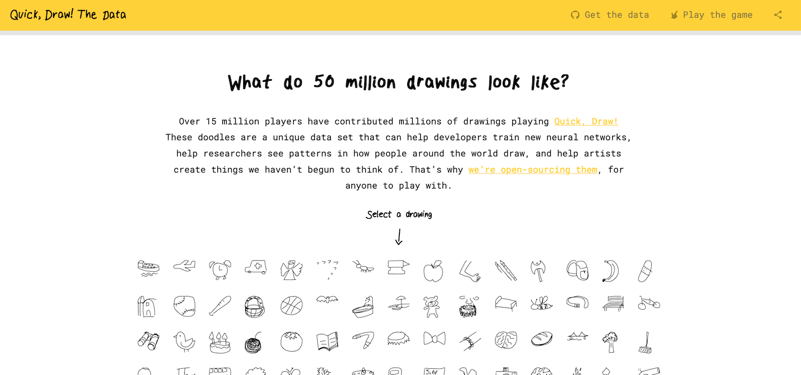
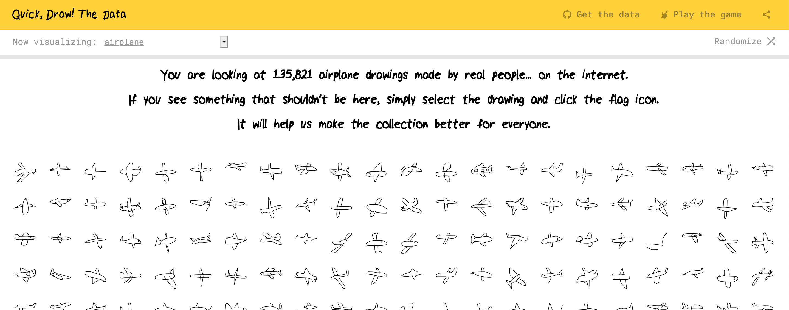
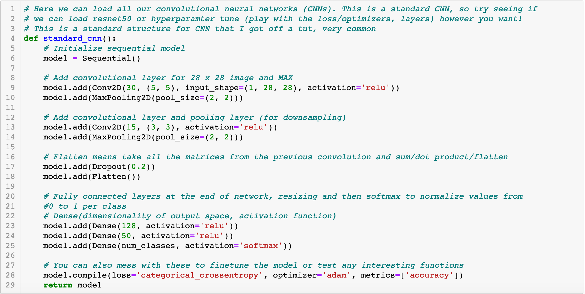
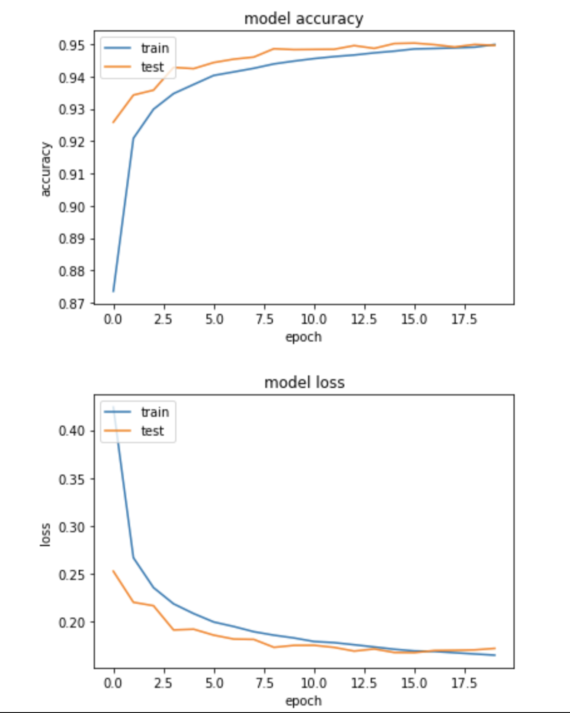
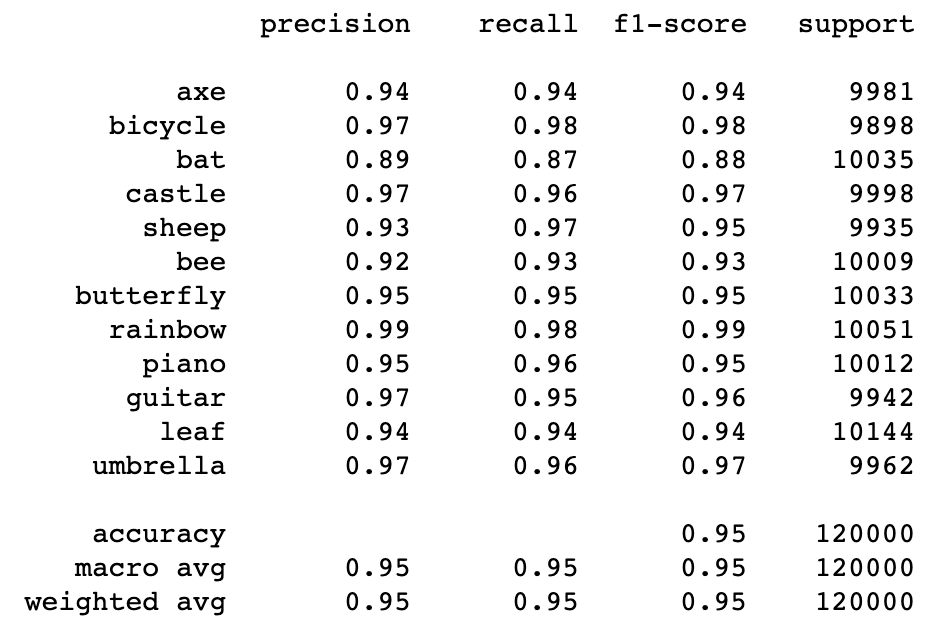
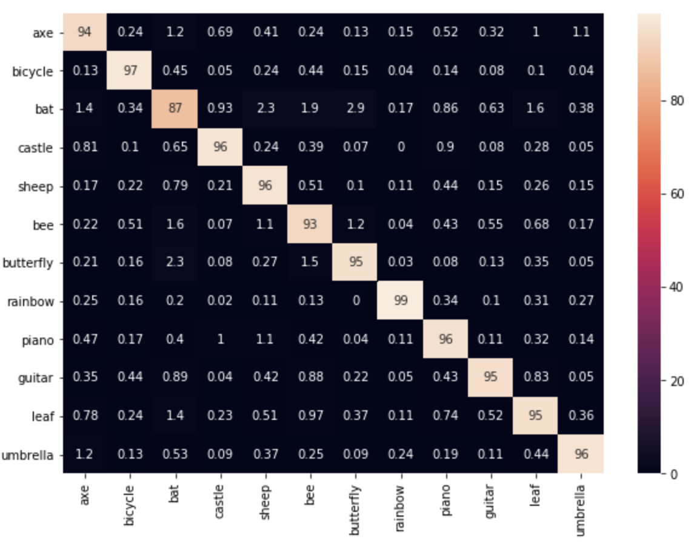

## Final ML Project: Emoji Classification
Riley Goodling - rgoodling3@gatech.edu

Haris Hussain - 

Yu Xin - 

Grace Armfield - 

### Introduction

Emojis have become an increasingly important feature in communication within the last decade. As the demand for emojis has increased, developers have created emojis for seemingly all images. Therefore, it can be difficult for users to find the emoji they are looking for. Our application aims to create a solution that will allow users to find their emoji by drawing a sketch of their desired emoji. This solution could be applied to various text editor applications in which users’ sketches could be easily transformed into emojis that have already been designed.

### Problem

With the evergrowing collection of emojis to choose from, we want to help users find their ideal emoji faster. There hae already been implementations of suggesting emojis to replace words in text, like on the Apple iPhone's predictive text feature, but we wanted to offer a solution that allows drawing images for accurate emoji suggestions. Emojis are overall a universal language, so this feature could be used as a translating dictionary without having to store data for words in every language. Along with everyday use, our feature could help those who are non-verbal express themselves better. By drawing the things they are thinking, it could help caretakers and friends better understand the needs and thoughts through emojis which can be understood by all. 

### Data

Our data is coming from a doodle dataset that was provided by Google. The data set can be found here: https://quickdraw.withgoogle.com/data. Using the labeled images, we searched for images that alligned with existing emojis. We then had a list of 95 emojis that could be matched with doodles from the dataset. Google's doodle dataset had more than 100,000 doodles for most of the images, so this provided us with more than enough data to train and test on. 

The Google Doodle Website looks like this:

And an example of an image's page looks like this:

Google released their data set to the public on GitHub (https://github.com/googlecreativelab/quickdraw-dataset) for access and use. 

### Approach

## Supervised Learing
To perform this image classification task efficiently, we plan to retrain an existing neural network architecture. Our approach is based on Convolutional Neural Network architecture (ConvNet) with ReLU activation function. It consists of five basic types of layers: convolution layer, ReLU layer, pooling layer, flattening layer, and fully connected layer. It is a widely applied architecture in the field of image recognition, offering high accuracy under reasonable training time. In particular, its ability to detect edge arrangements is ideal for simple hand-drawn figures in our project. Also, the trained neural network provides fast image classification speed, which is ideal for situations such as note-taking and texting. To achieve this, we retrain a ConvNet based on the Google Doodle dataset.  Thus, we hope to observe the training and inference of ConvNet on a dataset of 2D vector images.

We train the ConvNet with 12 classes, taking 50,000 samples from each class. Each image is 28x28 pixels, meaning we have 784 pixels per picture. We use the convulusion layer to reduce the data of each picture, pulling the 784 pixels down to around 50 data points. The convulusion layer will extract the important features from each image. Then the neural net layer will take the downsampled data and make a neural netowrk out of it. 

Here, we show a snippet of our code that was used to create this ConvNet. This method is the most important method that shapes the neural net and shows all the steps that were taken to accomplish our goal.

## Unsupervised Learning
We also implemented the Kmeans algorithm with the same classes from the same dataset. Kmeans is known for its simplicity and runtime speed. In our implementation, we increased the number of clusters to see its effects on accuracy and running speed. In the end, we compared results from Kmeans unsupervised algorithm to that of the ConvNet supervised learning model. 

### Results

Below, we have an image that shows our model's accuracy and loss. We wanted our accuracy to increase with each epoch, and our loss to decrease. As seen by the graph, this was achieved in the exact way that we hoped. 

The image shown below is a breakdown of the precision and recall of our CNN. Again, we achieved our goal of having both the precision and recall scores being as close to one as possible, resulting in a very high F1-score. This proves again that our CNN was successful at recognizing the objects so that we can class them with emoji labels.

The confusion matrix lines up very well with the other two images, showing that our CNN very accurately identified each image. Some of the values may seem a little off from 1, such as the bat only reaching an accuracy of 87%, but this is most likely linked to the fact that the data comes from human data inputs. Some of the images that are in the dataset are even difficult for humans to differentiate, as is depicted in the image of a 'bat' (as in the animal) below the confusion matrix. 

### Conclusion

As seen in our results section, our CNN has done a great job in identifying doodles from the Google Doodle dataset. This makes us hopeful that the algorithm will work with most humans, as the Google Doodle dataset is a collection of human made data. In the future, we all think this would be a great program to implement for many every day uses. With our model working very well and the emoji dictionary growing seemingly everyday, we could solve a small problem to make lives easier.
